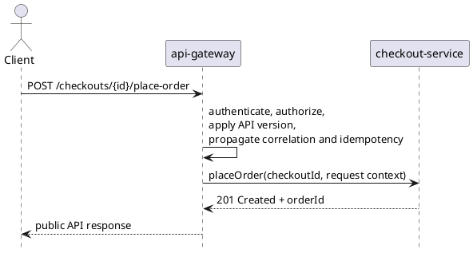

# api-gateway

`api-gateway` is the public REST entrypoint for web, mobile, and partner clients. It centralizes API versioning, authentication, authorization, request shaping, and context propagation before handing work to internal domain services.

## Main Info

- Runtime: Java / Spring Boot
- Modules: `api` for the public Java contract marker, `impl` for the Spring Boot runtime
- Storage: none; this service should stay stateless
- Primary callers: API clients and partner systems
- Primary downstreams: `customer-service`, `catalog-service`, `search-service`, `cart-service`, `checkout-service`, `order-service`, `notification-service`
- Owns: public HTTP contract, auth propagation, correlation, request normalization
- Does not own: customer, cart, checkout, order, or notification business state

## Primary Sequence

