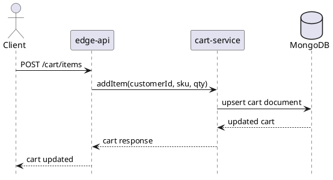

# cart-service

`cart-service` owns mutable shopping carts and saved-for-later state. Cart state is indicative and user-editable; it is not the same thing as a durable order.

## Main Info

- Runtime: Java / Spring Boot
- Modules: `api` for the public Java contract marker, `app` for the Spring Boot runtime
- Storage: MongoDB
- Primary callers: `edge-api`, `checkout-service`
- Primary downstreams: MongoDB
- Owns: active cart documents, line selections, saved items
- Does not own: final pricing decisions, order history, or payment state

## Primary Sequence

