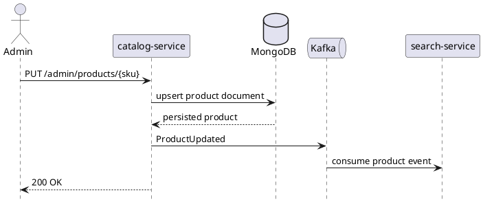

# catalog-service

`catalog-service` owns product master data and flexible category-specific attributes. It is the system of record for product content and emits product change events for downstream read models such as search.

## Main Info

- Runtime: Java / Spring Boot
- Modules: `api` for the public Java contract marker, `impl` for the Spring Boot runtime
- Storage: MongoDB
- Primary callers: `api-gateway`, admin or seller tools
- Primary downstreams: MongoDB, Kafka product events
- Owns: product master data, category-driven attributes, catalog write flows
- Does not own: search indexing behavior or pricing truth

## Primary Sequence

