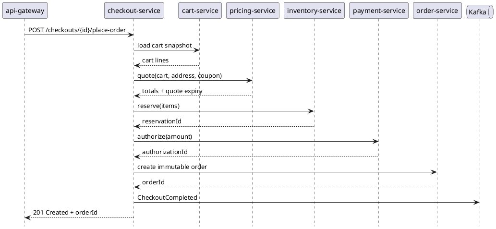

# checkout-service

`checkout-service` owns the short-lived workflow that turns a mutable cart into a valid immutable order. It is the orchestration boundary for repricing, stock reservation, payment authorization, idempotency, retries, and compensation.

## Main Info

- Runtime: Java / Spring Boot
- Modules: `api` for the public Java contract marker, `impl` for the Spring Boot runtime
- Storage: PostgreSQL
- Primary callers: `api-gateway`
- Primary downstreams: `cart-service`, `pricing-service`, `inventory-service`, `payment-service`, `order-service`, Kafka checkout events
- Owns: checkout attempts or sessions, idempotency state, compensation state, failure reasons
- Typical lifecycle: `INITIATED`, `PRICED`, `INVENTORY_RESERVED`, `PAYMENT_AUTHORIZED`, `ORDER_CREATED`, `FAILED`, `EXPIRED`
- Does not own: cart persistence, pricing rules, inventory truth, payment ledger, shipment execution, durable order history

## Primary Sequence

## Boundary Notes

- Keep temporary checkout state here instead of polluting `order-service` with pre-order statuses.
- Use this service to detect duplicate requests, manage retries, and coordinate compensation.
- On pricing mismatch, fail before inventory reservation and payment authorization.
- On payment failure, release inventory reservation.
- On order creation failure after payment authorization, void payment authorization, release reservation, and expose a safe retry state.
