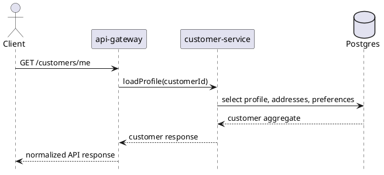

# customer-service

`customer-service` owns customer profile data, saved addresses, and customer preferences. It should not own authentication credentials when identity is provided by an external identity provider.

## Main Info

- Runtime: Java / Spring Boot
- Modules: `api` for the public Java contract marker, `impl` for the Spring Boot runtime
- Storage: PostgreSQL
- Primary callers: `api-gateway`, `checkout-service`, `order-service`
- Primary downstreams: PostgreSQL
- Owns: customer profiles, addresses, preferences
- Does not own: identity-provider credentials or checkout/order workflow state

## Primary Sequence

