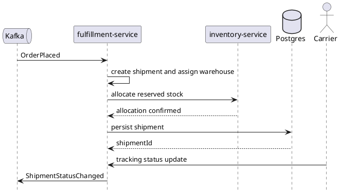

# fulfillment-service

`fulfillment-service` owns shipment creation, shipment status, and tracking updates. It runs after order creation and coordinates warehouse-facing shipment work plus downstream shipment events.

## Main Info

- Runtime: Java / Spring Boot
- Modules: `api` for the public Java contract marker, `app` for the Spring Boot runtime
- Storage: PostgreSQL
- Primary callers: order events, carrier webhooks
- Primary downstreams: `inventory-service`, PostgreSQL, Kafka shipment events
- Owns: shipment records, shipment status, tracking updates, warehouse assignment
- Does not own: synchronous checkout flow or durable order truth

## Primary Sequence

