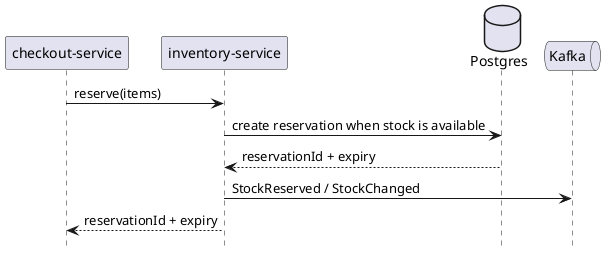

# inventory-service

`inventory-service` owns stock levels, reservation records, and warehouse availability. It protects inventory truth for checkout and fulfillment flows and emits stock events for downstream consumers.

## Main Info

- Runtime: Java / Spring Boot
- Modules: `api` for the public Java contract marker, `app` for the Spring Boot runtime
- Storage: PostgreSQL
- Primary callers: `checkout-service`, `fulfillment-service`, warehouse operations tools
- Primary downstreams: PostgreSQL, Kafka stock events
- Owns: stock counts, reservations, warehouse availability
- Does not own: checkout orchestration or shipment lifecycle

## Primary Sequence

