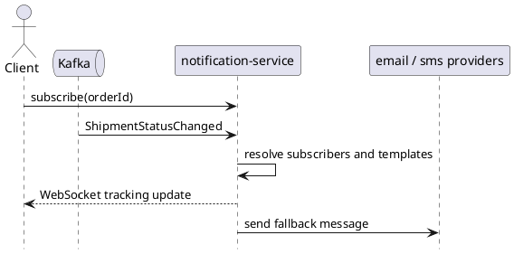

# notification-service

`notification-service` owns outbound real-time updates and later message delivery channels. It consumes order and shipment events, pushes live updates over WebSockets, and can fan out to email or SMS providers.

## Main Info

- Runtime: Java / Spring Boot
- Modules: `api` for the public Java contract marker, `app` for the Spring Boot runtime
- Storage: no primary transactional system of record is defined in this repo layout
- Primary callers: Kafka event streams, WebSocket clients
- Primary downstreams: WebSocket clients, email or SMS providers
- Owns: real-time client notifications, outbound delivery orchestration
- Does not own: order, checkout, or shipment source-of-truth state

## Primary Sequence

