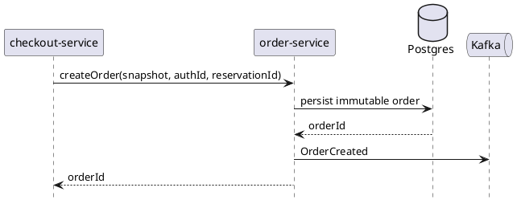

# order-service

`order-service` owns immutable order snapshots and the durable order lifecycle after checkout succeeds. It should stay focused on long-lived order history rather than absorbing temporary pre-order workflow state.

## Main Info

- Runtime: Java / Spring Boot
- Modules: `api` for the public Java contract marker, `app` for the Spring Boot runtime
- Storage: PostgreSQL
- Primary callers: `edge-api`, `checkout-service`, `fulfillment-service`
- Primary downstreams: PostgreSQL, Kafka order events
- Owns: immutable order snapshots, durable order lifecycle, post-purchase order reads
- Does not own: cart mutation, repricing orchestration, or payment authorization workflow

## Primary Sequence

