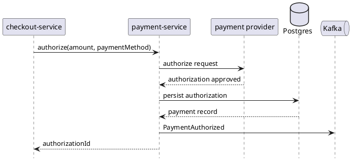

# payment-service

`payment-service` owns authorization, capture, refund, and payment-provider adapter logic. It keeps payment execution and provider-specific behavior out of checkout and order services.

## Main Info

- Runtime: Java / Spring Boot
- Modules: `api` for the public Java contract marker, `app` for the Spring Boot runtime
- Storage: PostgreSQL
- Primary callers: `checkout-service`, finance operations tools
- Primary downstreams: payment providers, PostgreSQL, Kafka payment events
- Owns: payment authorizations, captures, refunds, provider adapter behavior
- Does not own: checkout orchestration, order truth, or inventory reservation state

## Primary Sequence

