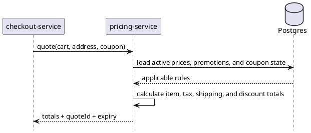

# pricing-service

`pricing-service` is intentionally not part of the Java Gradle multi-module build because it will be implemented in Go. It owns price calculation, promotions, coupon validation, and quote generation for cart and checkout flows.

This directory is kept under the same `on-shop` parent so the repository still represents the whole platform in one place.

## Main Info

- Runtime: Go service planned outside the Java multi-module build
- Modules: no Gradle `api` or `impl` modules; this directory reserves the service boundary in the repository
- Storage: PostgreSQL
- Primary callers: `checkout-service`, `cart-service`, pricing administration tools
- Primary downstreams: PostgreSQL, Kafka price events
- Owns: active prices, promotions, coupons, quote generation, quote expiry
- Does not own: cart persistence, order creation, or inventory truth

## Primary Sequence

