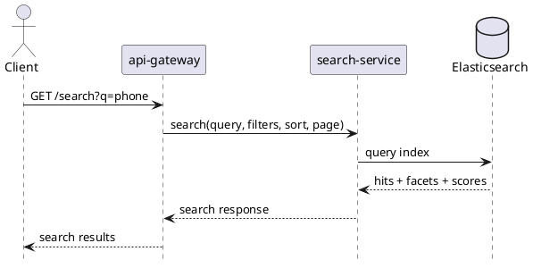

# search-service

`search-service` owns search query behavior and index update consumers. Product truth still lives in `catalog-service`, price truth in `pricing-service`, and stock truth in `inventory-service`.

## Main Info

- Runtime: Java / Spring Boot
- Modules: `api` for the public Java contract marker, `impl` for the Spring Boot runtime
- Storage: Elasticsearch
- Primary callers: `api-gateway`
- Primary downstreams: Elasticsearch
- Consumes: Kafka product, price, and stock events for index updates
- Owns: search query handling, relevance behavior, index consumer logic
- Does not own: product master data or price/inventory truth

## Primary Sequence

